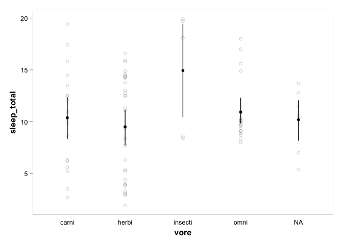
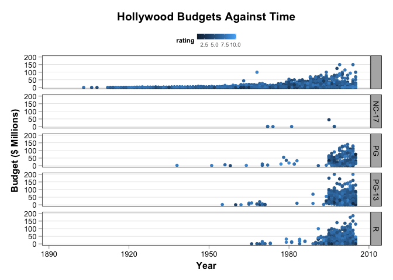
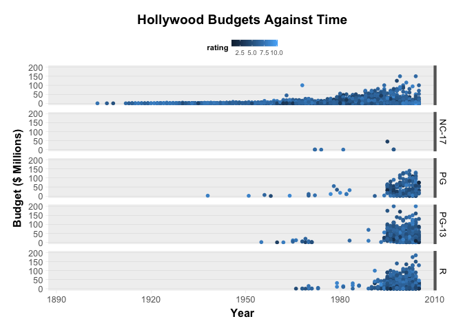
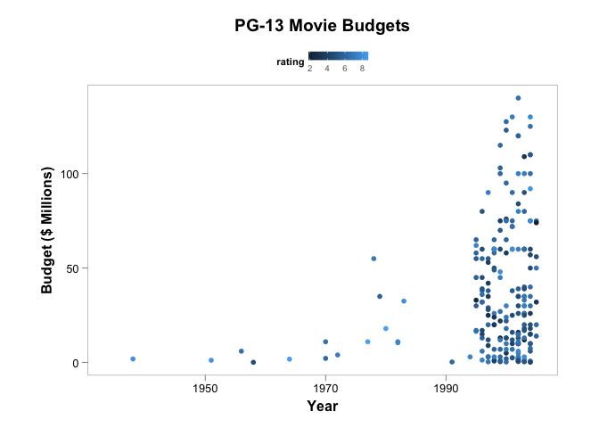
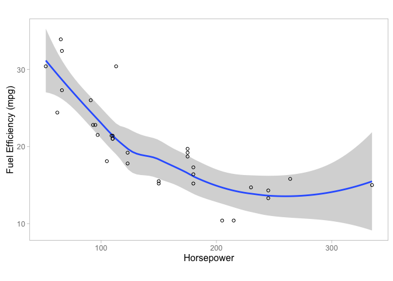

ggplot2bdc
==========

ggplot2bdc is a collection of themes and other things that can be used
when creating plots with [ggplot2](http://ggplot2.org/).

Installation
============

`ggplot2bdc` is not on [CRAN](http://cran.r-project.org/), but you can
use
[devtools](http://cran.r-project.org/web/packages/devtools/index.html)
to install the latest and greatest version. To do so:

    if(!require('devtools')) install.packages('devtools')
    library(devtools)
    install_github('briandconnelly/ggplot2bdc')

Examples
========

To gain access to the following themes, etc. provided, first load the
`gplot2bdc` package. We'll also load `ggplot`.

    library(ggplot2bdc)
    library(ggplot2)

theme\_bdc\_simplefacets
------------------------

`theme_bdc_simplefacets` is a clean theme that uses thin black panels on
a white background. Legends are placed above. Facet labels are displayed
as black text. Subtle grid lines can be added to the panels with the
`grid.x` and `grid.y` parameters.

    ggplot(movies, aes(x=year, y=budget/1000000, color=rating)) +
        geom_point() +
        facet_grid(mpaa ~ .) +
        labs(x='Year', y='Budget ($ Millions)', title='Hollywood Budgets Against Time') +
        theme_bdc_simplefacets(grid.y=TRUE, grid.x=FALSE)

theme\_bdc\_grey
----------------

`theme_bdc_grey` is a clean theme that uses thin grey panels on a white
background. Legends are placed above. Facet labels are displayed as
black text on a grey background.

    ggplot(movies, aes(x=year, y=budget/1000000, color=rating)) +
        geom_point() +
        facet_grid(mpaa ~ .) +
        labs(x='Year', y='Budget ($ Millions)', title='Hollywood Budgets Against Time') +
        theme_bdc_grey()

Subtle grid lines can be added to the panels with the `grid.x` and
`grid.y` parameters:

    ggplot(movies, aes(x=year, y=budget/1000000, color=rating)) +
        geom_point() +
        facet_grid(mpaa ~ .) +
        labs(x='Year', y='Budget ($ Millions)', title='Hollywood Budgets Against Time') +
        theme_bdc_grey(grid.x=FALSE, grid.y=TRUE)

Some people prefer to display categorical data without tick marks along
the axis. These are included by default, but can be removed by setting
either the `ticks.x` or `ticks.y` parameters to `FALSE`.

    ggplot(msleep, aes(x=vore, y=sleep_total)) +
        geom_point(shape=1, alpha=0.2) +
        stat_summary(fun.data='mean_cl_boot') +
        theme_bdc_grey(ticks.x=FALSE)

theme\_bdc\_black
-----------------

`theme_bdc_black` is a clean theme that uses thin black panels on a
white background. Legends are placed above. Facet labels are displayed
as black text on a grey background. Subtle grid lines can be added to
the panels with the `grid.x` and `grid.y` parameters, and tick markscan
be managed with `ticks.x` and `ticks.y`.

    ggplot(movies, aes(x=year, y=budget/1000000, color=rating)) +
        geom_point() +
        facet_grid(mpaa ~ .) +
        labs(x='Year', y='Budget ($ Millions)', title='Hollywood Budgets Against Time') +
        theme_bdc_black(grid.y=TRUE, grid.x=FALSE)

theme\_bdc\_paneled
-------------------

`theme_bdc_paneled` is a clean theme that displays plots without borders
on grey panels. Legends are placed above. Facet labels are displayed as
plan black text. Subtle grid lines can be added to the panels with the
`grid.x` and `grid.y` parameters, and tick markscan be managed with
`ticks.x` and `ticks.y`. By default, grid lines are used along the Y
axis. This theme is best suited for plots with multiple facets.

    ggplot(movies, aes(x=year, y=budget/1000000, color=rating)) +
        geom_point() +
        facet_grid(mpaa ~ .) +
        labs(x='Year', y='Budget ($ Millions)', title='Hollywood Budgets Against Time') +
        theme_bdc_paneled()

To more clearly distinguish the individual panels, thick lines can be
added on the far right of each panel. For example:

    ggplot(movies, aes(x=year, y=budget/1000000, color=rating)) +
        geom_point() +
        facet_grid(mpaa ~ .) +
        labs(x='Year', y='Budget ($ Millions)', title='Hollywood Budgets Against Time') +
        geom_vline(aes(xintercept=Inf), color='grey40', size=3) +
        theme_bdc_paneled()

theme\_bdc\_simple
------------------

`theme_bdc_simple` is a classic theme that displays plot axes as solid
black lines on a white background. This theme is probably best suited to
single-panel plots.

    ggplot(movies, aes(x=year, y=length, color=rating, shape=mpaa)) +
        geom_point() +
        labs(x='Year', y='Length (Minutes)', title='Movie Lengths Against Time') +
        scale_y_log10() +
        theme_bdc_simple()

theme\_bdc\_microtiter
----------------------

`theme_bdc_microtiter` is a specialized theme for use in creating
figures that represent 96-well microtiter plates.

    ggplot(data=platemap, aes(x=Column, y=Row)) +
        geom_point(data=expand.grid(seq(1,12), seq(1,8)), aes(x=Var1, y=Var2), color='grey90', fill='white', shape=21, size=6) +
        geom_point(aes(shape=Environment, colour=Strain), size=10) +
        coord_fixed(ratio=(13/12)/(9/8), xlim=c(0.5,12.5), ylim=c(0.5,8.5)) +
        scale_y_reverse(breaks=seq(1,8), labels=LETTERS[1:8]) +
        scale_x_continuous(breaks=seq(1,12)) +
        labs(title="Plate Layout for My Experiment") +
        theme_bdc_microtiter()

For more information, see the "Plotting Plate Maps" vignette (coming
soon)

rescale\_golden
---------------

`rescale_golden` adjusts the proportions of the axes of the given plot
object so that follow the golden ratio (horizontally). If no plot is
provided, the last plot that was displayed is used.

    ggplot(mtcars, aes(x=hp, y=mpg)) +
        geom_smooth() +
        geom_point(shape=1) +
        labs(x='Horsepower', y='Fuel Efficiency (mpg)') +
        theme_bdc_grey()

    rescale_golden()

rescale\_square
---------------

`rescale_square` adjusts the proportions of the axes of the given plot
object so that they are equal. If no plot is provided, the last plot
that was displayed is used.

    library(dplyr)

    pg_movies <- filter(movies, mpaa=='PG')

    ggplot(pg_movies, aes(x=budget/10^6, y=rating)) +
        geom_smooth() +
        geom_point(shape=1) +
        labs(x='Budget ($ Millions)', y='Rating', title='Does Budget Affect Movie Ratings?') +
        theme_bdc_grey()

    rescale_square()

rescale\_plot
-------------

`rescale_plot` adjusts the proportions of the axes of the given plot
object to the given ratio. If no plot is provided, the last plot that
was displayed is used.

    library(dplyr)

    pg_movies <- filter(movies, mpaa=='PG')

    ggplot(pg_movies, aes(x=budget/10^6, y=rating)) +
        geom_smooth() +
        geom_point(shape=1) +
        labs(x='Budget ($ Millions)', y='Rating', title='Does Budget Affect Movie Ratings?') +
        theme_bdc_grey()

    rescale_plot(ratio=1)

coord\_golden
-------------

`coord_golden` sets the aspect ratio of the axes according to the golden
ratio. Whether the panel follows the golden ratio horizontally or
vertically can be set using the `orientation` argument. For an
introduction to how aspect ratio affects perception, see [Aspect Ratio
and Banking to 45
Degrees](http://eagereyes.org/basics/banking-45-degrees).

    library(dplyr)

    pg_movies <- filter(movies, mpaa=='PG')

    ggplot(pg_movies, aes(x=year, y=budget/10^6, color=rating)) +
        geom_point() +
        labs(x='Year', y='Budget ($ Millions)', title='PG-13 Movie Budgets') +
        theme_bdc_grey() +
        coord_golden(xvals=pg_movies$year, yvals=pg_movies$budget/10^6,
                     orientation='horizontal')

coord\_square
-------------

`coord_square` sets the aspect ratio of the axes according to a square.

    library(dplyr)

    pg_movies <- filter(movies, mpaa=='PG')

    ggplot(pg_movies, aes(x=budget/10^6, y=rating)) +
        geom_smooth() +
        geom_point(shape=1) +
        labs(x='Budget ($ Millions)', y='Rating', title='Does Budget Affect Movie Ratings?') +
        theme_bdc_grey() +
        coord_square(xvals=pg_movies$budget/10^6, yvals=movies$rating)

ggsave\_golden
--------------

`ggsave_golden` saves the given plot to the given filename. If no plot
is specified, the most recently displayed plot is used. The proportions
of the plot's axes should first be set to the golden ratio using
`rescale_golden` or `coord_golden`.

    ggplot(mtcars, aes(x=hp, y=mpg)) +
        geom_smooth() +
        geom_point(shape=1) +
        labs(x='Horsepower', y='Fuel Efficiency (mpg)') +
        theme_bdc_grey()

    rescale_golden()

    ggsave_golden('mpg against horsepower.pdf')
