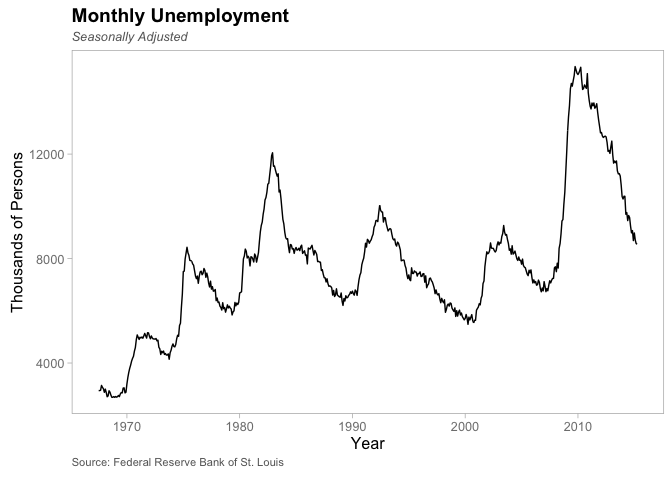
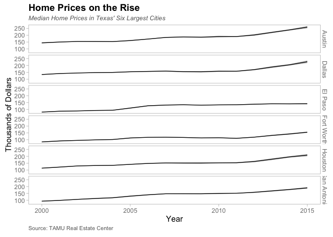
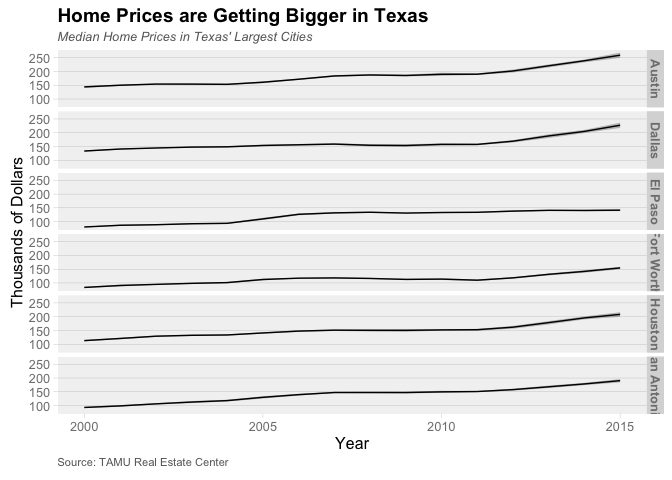
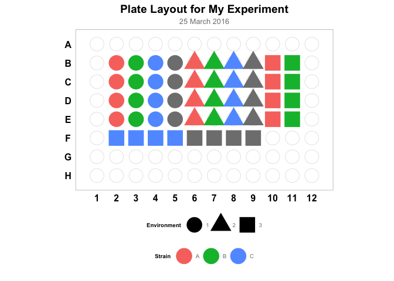
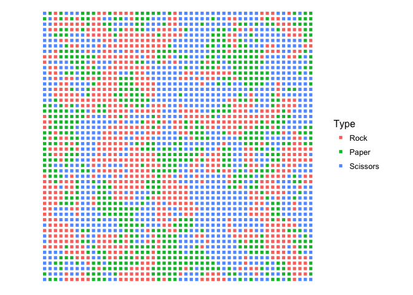
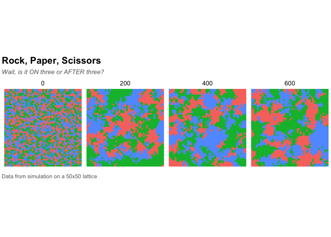
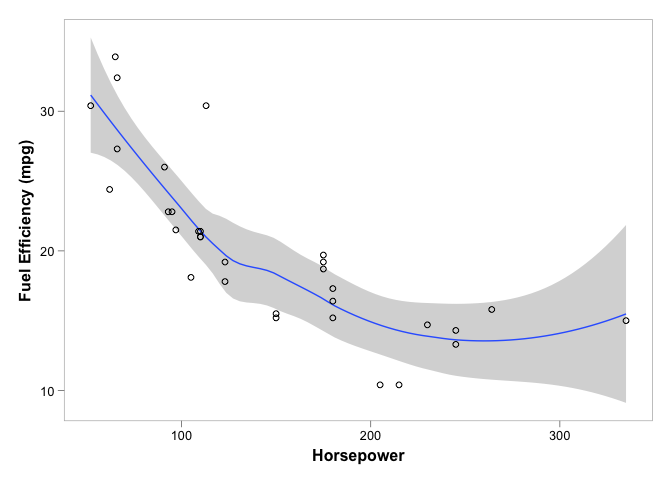
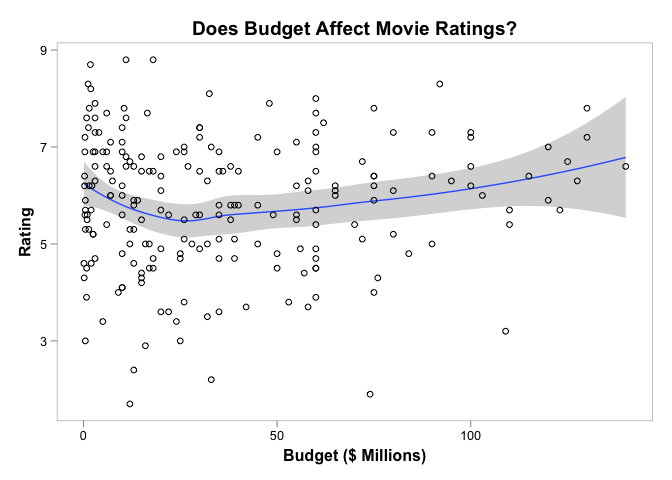
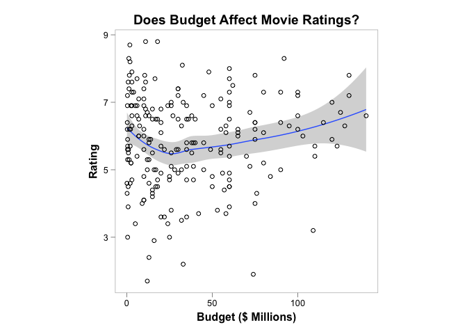
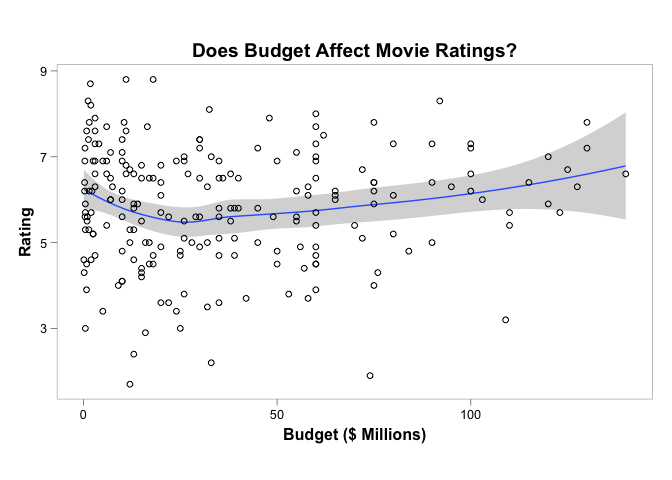

ggplot2bdc
==========

ggplot2bdc is a collection of themes and other things that can be used
when creating plots with [ggplot2](http://ggplot2.org/).

Installation
------------

`ggplot2bdc` is not on [CRAN](http://cran.r-project.org/), but you can
use
[devtools](http://cran.r-project.org/web/packages/devtools/index.html)
to install the latest and greatest version. To do so:

    if(!require("devtools")) install.packages("devtools")
    devtools::install_github("briandconnelly/ggplot2bdc")

Examples
--------

To gain access to the following themes, etc. provided, first load the
`gplot2bdc` package. We'll also load `ggplot`, `dplyr`, and `magrittr`
for these examples.

    library(ggplot2bdc)
    library(ggplot2)
    library(dplyr)
    library(magrittr)

### theme\_bdc\_grey

`theme_bdc_grey` is a clean theme that uses thin grey panels on a white
background. Legends are placed above. Facet labels are displayed as
black text on a grey background.

    ggplot(data = economics, aes(x = date, y = unemploy)) +
        geom_line() +
        scale_x_date() +
        labs(x = "Year", y = "Thousands of Persons",
             title = "Monthly Unemployment", subtitle = "Seasonally Adjusted",
             caption = "Source: Federal Reserve Bank of St. Louis") +
        theme_bdc_grey()

Subtle grid lines can be added to the panels with the `grid.x` and
`grid.y` parameters.

    midwest$inmetro <- factor(midwest$inmetro, levels = c(0, 1),
                              labels = c("Rural", "Metro"))

    ggplot(data = midwest,
           aes(x = inmetro, y = percbelowpoverty, color = state, shape = state)) +
        stat_summary(fun.y = "mean", geom = "line", aes(group = state)) +
        stat_summary(fun.y = "mean", geom = "point") +
        scale_color_hue(name = "State") +
        scale_shape_discrete(name = "State") +
        labs(x = NULL, y = "Percent of Population",
             title = "Poverty in the Midwest") +
        coord_equal(ratio = 0.5) +
        theme_bdc_grey(ticks.x = FALSE, grid.y = TRUE)

Some people prefer to display categorical data without tick marks along
the axis. These are included by default, but can be removed by setting
either the `ticks.x` or `ticks.y` parameters to `FALSE`.

### theme\_bdc\_simplefacets

`theme_bdc_simplefacets` is a modification of `theme_bdc_grey` where
facet labels are displayed as grey text on a white background.

    txcities <- txhousing %>%
        filter(city %in% c("Austin", "Dallas", "El Paso", "Fort Worth", "Houston",
                           "San Antonio"))

    ggplot(data = txcities, aes(x = year, y = median / 1000)) +
        facet_grid(city ~ .) +
        stat_summary(fun.data = "mean_cl_boot", geom = "ribbon",
                     color = NA, alpha = 0.3) +
        stat_summary(fun.y = "mean", geom = "line") +
        labs(x = "Year", y = "Thousands of Dollars",
             title = "Home Prices on the Rise",
             subtitle = "Median Home Prices in Texas' Six Largest Cities",
             caption = "Source: TAMU Real Estate Center") +
        theme_bdc_simplefacets()

### theme\_bdc\_paneled

`theme_bdc_paneled` is a clean theme that displays plots without borders
on grey panels. Legends are placed above. Facet labels are displayed as
plan black text. Subtle grid lines can be added to the panels with the
`grid.x` and `grid.y` parameters, and tick markscan be managed with
`ticks.x` and `ticks.y`. By default, grid lines are used along the Y
axis. This theme is best suited for plots with multiple facets.

    ggplot(data = txcities, aes(x = year, y = median / 1000)) +
        facet_grid(city ~ .) +
        stat_summary(fun.data = "mean_cl_boot", geom = "ribbon",
                     color = NA, alpha = 0.3) +
        stat_summary(fun.y = "mean", geom = "line") +
        labs(x = "Year", y = "Thousands of Dollars",
             title = "Home Prices are Getting Bigger in Texas",
             subtitle = "Median Home Prices in Texas' Six Largest Cities") +
        theme_bdc_paneled()

To more clearly distinguish the individual panels, thick lines can be
added on the far right of each panel. For example:

    # TODO: update me
    ggplot(movies, aes(x = year, y = budget / 1000000, color = rating)) +
        geom_point() +
        facet_grid(mpaa ~ .) +
        labs(x="Year", y="Budget ($ Millions)",
             title="Hollywood Budgets Against Time") +
        geom_vline(aes(xintercept = Inf), color = "grey40", size = 3) +
        theme_bdc_paneled()

### theme\_bdc\_microtiter

`theme_bdc_microtiter` is a specialized theme for use in creating
figures that represent 96-well microtiter plates.

    ggplot(data = platemap, aes(x = Column, y = Row)) +
        geom_point(data = expand.grid(Column = seq(1,12), Row = seq(1,8)),
                   color = "grey90", fill = "white", shape = 21, size = 8) +
        geom_point(aes(shape = Environment, colour = Strain), size = 10) +
        coord_fixed(ratio = (13/12)/(9/8), xlim = c(0.5, 12.5), ylim = c(0.6, 8.4)) +
        scale_y_reverse(breaks = seq(1,8), labels = LETTERS[1:8]) +
        scale_x_continuous(breaks = seq(1,12)) +
        labs(title = "Plate Layout for My Experiment", subtitle = "25 March 2016") +
        theme_bdc_microtiter()

For more information, see the [Plotting Microtiter Plate
Maps](http://bconnelly.net/2014/05/plotting-microtiter-plate-maps/).

### theme\_bdc\_lattice\_population

`theme_bdc_lattice_population` is a specialized theme intended to
display populations of individuals structured spatially in a lattice.

    ggplot(data = filter(rockpaperscissors, Time == 10),
           aes(x = X, y = Y, color = Type)) +
            geom_point(shape=15) +
            coord_equal(ratio=1) +
            scale_color_hue() +
            theme_bdc_lattice_population()

We can also show multiple population states:

    ggplot(data = filter(rockpaperscissors, Time %in% c(0, 200, 400, 600)),
           aes(x = X, y = Y, color = Type)) +
        facet_wrap(~Time, nrow = 1, ncol = 4) +
        geom_point(shape = 15) +
        coord_equal(ratio = 1) +
        scale_color_hue(guide = FALSE) +
        labs(title = "Rock, Paper, Scissors",
             subtitle = "Wait, is it ON three or AFTER three?",
             caption = "Data from simulation on a 50x50 lattice") +
        theme_bdc_lattice_population()

### rescale\_golden

`rescale_golden` adjusts the proportions of the axes of the given plot
object so that follow the golden ratio (horizontally). If no plot is
provided, the last plot that was displayed is used.

    ggplot(mtcars, aes(x = hp, y = mpg)) +
        geom_smooth() +
        geom_point(shape = 1) +
        labs(x = "Horsepower", y = "Fuel Efficiency (mpg)") +
        theme_bdc_grey()

    rescale_golden()

### rescale\_square

`rescale_square` adjusts the proportions of the axes of the given plot
object so that they are equal. If no plot is provided, the last plot
that was displayed is used.

    ggplot(data = economics, aes(x = date, y = unemploy)) +
        geom_line() +
        labs(x = "Date", y = "Thousands of Unemployed Persons") +
        theme_bdc_grey()

    rescale_square()

### rescale\_plot

`rescale_plot` adjusts the proportions of the axes of the given plot
object to the given ratio. If no plot is provided, the last plot that
was displayed is used.

    ggplot(data = economics, aes(x = date, y = unemploy)) +
        geom_line() +
        labs(x = "Date", y = "Unemployed Persons (x1000)") +
        theme_bdc_grey()

    rescale_plot(ratio = 16 / 9)

### coord\_golden

`coord_golden` sets the aspect ratio of the axes according to the golden
ratio. Whether the panel follows the golden ratio horizontally or
vertically can be set using the `orientation` argument. For an
introduction to how aspect ratio affects perception, see [Aspect Ratio
and Banking to 45
Degrees](http://eagereyes.org/basics/banking-45-degrees).

    # TODO: update this
    pg_movies <- filter(movies, mpaa == "PG")

    ggplot(pg_movies, aes(x=year, y=budget / 10^6, color=rating)) +
        geom_point() +
        labs(x="Year", y="Budget ($ Millions)", title="PG-13 Movie Budgets") +
        theme_bdc_grey() +
        coord_golden(xvals=pg_movies$year, yvals=pg_movies$budget / 10^6,
                     orientation="horizontal")

### coord\_square

`coord_square` sets the aspect ratio of the axes according to a square.

    # TODO update this
    pg_movies <- filter(movies, mpaa == "PG")

    ggplot(pg_movies, aes(x = budget / 10^6, y = rating)) +
        geom_smooth() +
        geom_point(shape = 1) +
        labs(x="Budget ($ Millions)", y="Rating",
             title="Does Budget Affect Movie Ratings?") +
        theme_bdc_grey() +
        coord_square(xvals = pg_movies$budget / 10^6, yvals = movies$rating)

### ggsave\_golden

`ggsave_golden` saves the given plot to the given filename. If no plot
is specified, the most recently displayed plot is used. The proportions
of the plot's axes should first be set to the golden ratio using
`rescale_golden` or `coord_golden`.

    p <- ggplot(mtcars, aes(x = hp, y = mpg)) +
        geom_smooth() +
        geom_point(shape = 1) +
        labs(x = "Horsepower", y = "Fuel Efficiency (mpg)") +
        theme_bdc_grey()
    p <- rescale_golden(plot = p)
    ggsave_golden(filename = "mpg_against_horsepower.pdf", plot = p)
