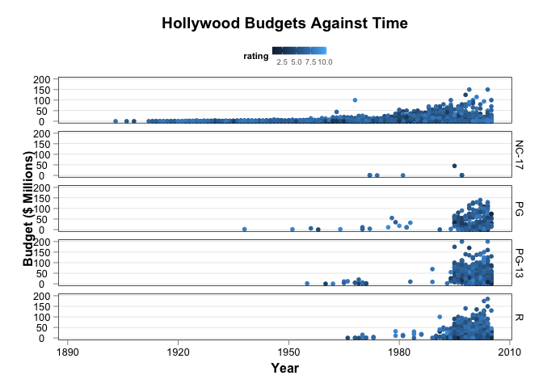
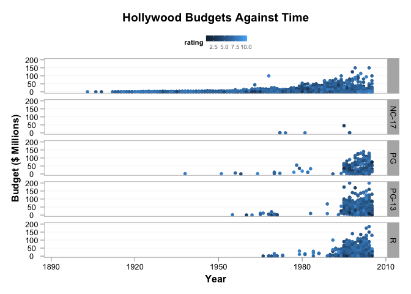
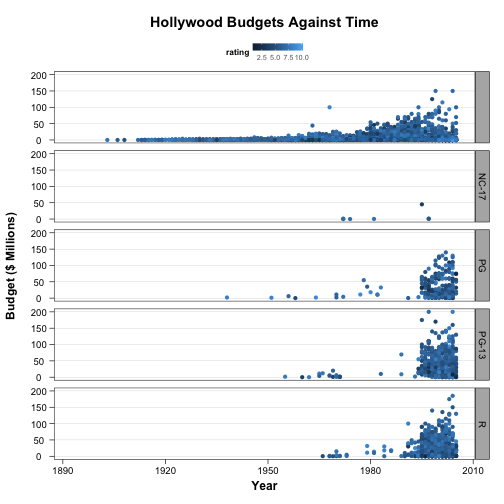
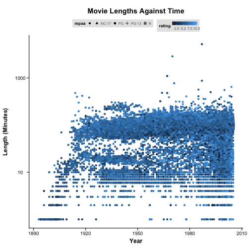
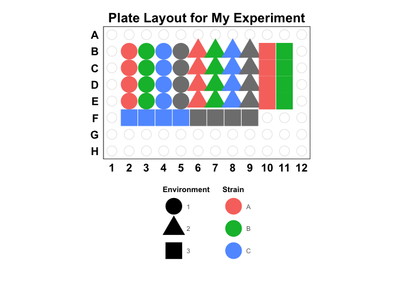
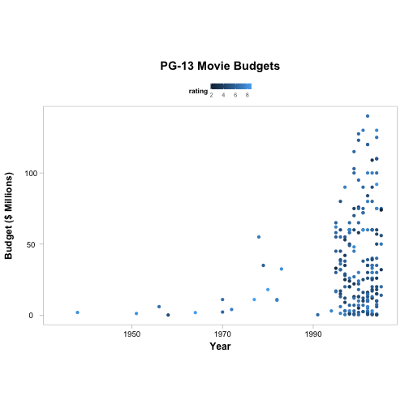
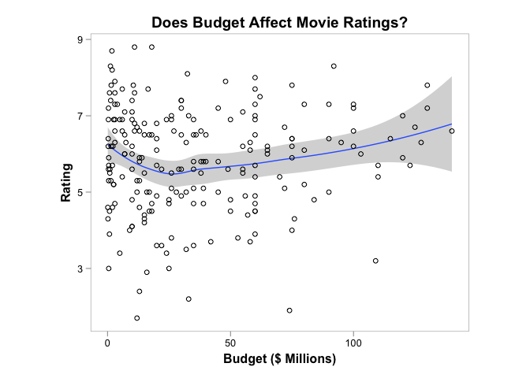

# ggplot2bdc

ggplot2bdc is a collection of themes and other things that can be used when
creating plots with [ggplot2](http://ggplot2.org/).

# Installation

`ggplot2bdc` is not on [CRAN](http://cran.r-project.org/), but you can use
[devtools](http://cran.r-project.org/web/packages/devtools/index.html) to
install the latest and greatest version. To do so:

    install.packages('devtools')
    library(devtools)
    install_github('briandconnelly/ggplot2bdc')


# Examples

To gain access to the following themes, etc. provided, first load the
`gplot2bdc` package


```r
library(ggplot2bdc)
```


## theme_bdc_simplefacets

`theme_bdc_simplefacets` is a clean theme that uses thin black panels on a white
background. Legends are placed above. Facet labels are displayed as black text.
Subtle grid lines can be added to the panels with the `grid.x` and `grid.y`
parameters.


```r
ggplot(movies, aes(x = year, y = budget/1e+06, color = rating)) + geom_point() + 
    facet_grid(mpaa ~ .) + labs(x = "Year", y = "Budget ($ Millions)", title = "Hollywood Budgets Against Time") + 
    theme_bdc_simplefacets(grid.y = TRUE, grid.x = FALSE)
```

 


## theme_bdc_grey

`theme_bdc_grey` is a clean theme that uses thin grey panels on a white
background. Legends are placed above. Facet labels are displayed as black text
on a grey background.


```r
ggplot(movies, aes(x = year, y = budget/1e+06, color = rating)) + geom_point() + 
    facet_grid(mpaa ~ .) + labs(x = "Year", y = "Budget ($ Millions)", title = "Hollywood Budgets Against Time") + 
    theme_bdc_grey()
```

 


Subtle grid lines can be added to the panels with the `grid.x` and `grid.y`
parameters:


```r
ggplot(movies, aes(x = year, y = budget/1e+06, color = rating)) + geom_point() + 
    facet_grid(mpaa ~ .) + labs(x = "Year", y = "Budget ($ Millions)", title = "Hollywood Budgets Against Time") + 
    theme_bdc_grey(grid.x = FALSE, grid.y = TRUE)
```

 


## theme_bdc_black

`theme_bdc_black` is a clean theme that uses thin black panels on a white
background. Legends are placed above. Facet labels are displayed as black text
on a grey background. Subtle grid lines can be added to the panels with the
`grid.x` and `grid.y` parameters.


```r
ggplot(movies, aes(x = year, y = budget/1e+06, color = rating)) + geom_point() + 
    facet_grid(mpaa ~ .) + labs(x = "Year", y = "Budget ($ Millions)", title = "Hollywood Budgets Against Time") + 
    theme_bdc_black(grid.y = TRUE, grid.x = FALSE)
```

 


## theme_bdc_simple

`theme_bdc_simple` is a classic theme that displays plot axes as solid black
lines on a white background. This theme is probably best suited to single-panel
plots.


```r
ggplot(movies, aes(x = year, y = length, color = rating, shape = mpaa)) + geom_point() + 
    labs(x = "Year", y = "Length (Minutes)", title = "Movie Lengths Against Time") + 
    scale_y_log10() + theme_bdc_simple()
```

 


## theme_bdc_microtiter

`theme_bdc_microtiter` is a specialized theme for use in creating figures that
represent 96-well microtiter plates.


```r
ggplot(data = platemap, aes(x = Column, y = Row)) + geom_point(data = expand.grid(seq(1, 
    12), seq(1, 8)), aes(x = Var1, y = Var2), color = "grey90", fill = "white", 
    shape = 21, size = 6) + geom_point(aes(shape = Environment, colour = Strain), 
    size = 10) + coord_fixed(ratio = (13/12)/(9/8), xlim = c(0.5, 12.5), ylim = c(0.5, 
    8.5)) + scale_y_reverse(breaks = seq(1, 8), labels = LETTERS[1:8]) + scale_x_continuous(breaks = seq(1, 
    12)) + labs(title = "Plate Layout for My Experiment") + theme_bdc_microtiter()
```

 


For more information, see the "Plotting Plate Maps" vignette (coming soon)

## coord_golden

`coord_golden` sets the aspect ratio of the axes according to the golden ratio.
Whether the panel follows the golden ratio horizontally or vertically can be set
using the `orientation` argument. For an introduction to how aspect ratio
affects perception, see
[Aspect Ratio and Banking to 45 Degrees](http://eagereyes.org/basics/banking-45-degrees).


```r
library(dplyr)

pg_movies <- filter(movies, mpaa == "PG")

ggplot(pg_movies, aes(x = year, y = budget/10^6, color = rating)) + geom_point() + 
    labs(x = "Year", y = "Budget ($ Millions)", title = "PG-13 Movie Budgets") + 
    theme_bdc_grey() + coord_golden(xvals = pg_movies$year, yvals = pg_movies$budget/10^6, 
    orientation = "horizontal")
```

 


## coord_square

`coord_square` sets the aspect ratio of the axes according to a square.


```r
library(dplyr)

pg_movies <- filter(movies, mpaa == "PG")

ggplot(pg_movies, aes(x = budget/10^6, y = rating)) + geom_smooth() + geom_point(shape = 1) + 
    labs(x = "Budget ($ Millions)", y = "Rating", title = "Does Budget Affect Movie Ratings?") + 
    theme_bdc_grey() + coord_square(xvals = pg_movies$budget/10^6, yvals = movies$rating)
```

 

